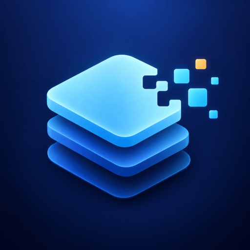

# MacCleaner



Native dev-cache cleaner for macOS. No dependencies, ~1 MB.


MacCleaner finds and measures the caches left behind by developer tools — Xcode, Gradle, Android Studio, npm, Cargo, Homebrew, Docker, and more — and lets you delete what you choose. **58 categories** across 9 groups, including AI-assistant leftovers and build artifacts inside your own projects.

## Features

- **Scan-only by default** — analyzing never deletes anything
- **58 categories in 9 groups**: Xcode, JVM / Android, Node, other languages, AI tools, project artifacts, dev tools, browsers, system
- **Risk-based selection** — nothing is pre-selected; bulk-select by risk level with live totals
- **Expandable rows** — 18 categories break down by version, project, app, device, etc., with per-item size and last-modified date
- **Stale highlighting** — items untouched for 6+ months are flagged in amber
- **Safety first** — never touches anything outside your home directory, skips TCC-protected paths, moves to Trash by default
- **Accurate measuring** — counts allocated blocks like `du`, deduplicates hard links, never double-counts a path
- **Localized in 43 languages**, follows your system language with English fallback

## Requirements

- macOS 13 or later
- Xcode 15+ / Swift 5.9+ (only to build from source)

## Installation

### Build from source

```bash
git clone https://github.com/jsoriase/MacCleaner.git
cd MacCleaner
./build.sh
```

This produces a universal (`arm64 + x86_64`) `MacCleaner.app` in the project root. To install:

```bash
cp -R MacCleaner.app /Applications/
```

> The app is ad-hoc signed, so on first launch macOS will warn that it is not from an identified developer. Right-click > Open, or allow it in Settings > Privacy & Security.

## Usage

1. **Analyze.** Click Analyze to measure everything. Nothing is deleted.
2. **Select.** Nothing is selected on launch — every cleanup is an explicit choice.
   - Use the three toolbar buttons to bulk-select by risk level (`Safe`, `Rebuild`, `Caution`). They stack: `Safe` + `Rebuild` selects both.
   - Each button shows its own total, so you see the gain before deciding.
   - Or select individual rows, or hover a group header for `All` / `None`.
   - Selection is not remembered between launches.
3. **Clean.** A confirmation dialog shows exactly how much and what will be removed, with a separate warning for `Caution` items.

Other UI details:

- The header shows both reclaimable space and current free space (`6.5 GB free of 245 GB`).
- Expandable rows show each sub-item with size and relative last-modified date (`3 hours ago`, `3 months ago`).
- Right-click > **Show in Finder** opens a row's path — useful before deleting `Caution` items.

## What it cleans

| Group | Examples |
| ----- | -------- |
| Xcode | DerivedData (per project), Archives (per date), DeviceSupport (per iOS version), simulators (per device) |
| JVM / Android | Gradle caches (per version), wrapper dists, Android emulators (per AVD), system images (per API) |
| Node | npm, pnpm store, Yarn, Bun caches |
| Languages | Cargo, Go, Python, Ruby, Maven, etc. |
| AI tools | Agent worktrees (per branch), assistant VMs, downloaded models |
| Project artifacts | `node_modules`, `Pods`, `target`, `build`, `.venv` found under `~/Projects`, `~/Code`, `~/dev`, `~/Developer`, `~/src`, `~/GitHub`, `~/Workspace`, `~/repos`, `~/Sites` |
| Dev tools | JetBrains caches (per IDE version), Homebrew, Docker, Electron / sandboxed app caches (per app) |
| Browsers | Chromium-family cache, service workers, site storage, history, cookies |
| System | User caches, logs, Trash |

### Risk levels

Every category has one, with a matching bulk-select button:

- **Safe** — regenerates on its own, no side effects.
- **Rebuild** — safe, but the next build / launch will be slower.
- **Caution** — requires re-downloading or loses useful data (Xcode Archives, Maven repo, project dependencies, Trash, …).

Hovering a row's badge explains *why* it has that level.

### Special cases

**Project artifacts** live where your code lives, not at a fixed path. Two rows (`Project dependencies`, `Build outputs`) sweep your code folders up to 8 levels deep, skipping hidden directories (except artifacts like `.build`, `.venv`, `.next`) and never descending into a match (so a `build` inside `node_modules` isn't counted twice). Home directory only — external drives and `/Volumes` are excluded.

**Simulators and Docker are delegated to their own tools**, not `rm`:

- Simulators: `xcrun simctl delete <UDID>`
- Docker: `docker system prune --force` (without `--all` / `--volumes`, so tagged images and database volumes are preserved)

For these two rows space is re-measured after cleanup, and Trash does not apply.

**Browsers:** Chromium browsers (Chrome, Brave, Edge, Chromium, Vivaldi) share a profile layout and are handled per profile. Almost all reclaimable space is cache (~97%); history and cookies are included for privacy, not space. Firefox derivatives share the cache / storage rows, but history is excluded (Firefox stores history and bookmarks in a single `places.sqlite`). Safari is not included — it requires Full Disk Access, which this app deliberately does not request.

## Safety

Three layers, all covered by tests:

1. Nothing outside `$HOME` is ever touched — no `/`, no `/System`, no other volumes.
2. Top-level home folders (`Library`, `Documents`, `Desktop`, `Downloads`, `Pictures`, …) are protected.
3. TCC-protected paths (`com.apple.Music`, `com.apple.Photos`, `MobileSync`, …) are ignored entirely — even reading them would trigger a permission prompt and freeze the scan.

Deletion moves to Trash by default (except the two tool-delegated rows, which delete immediately). Freed space is reported as "Moved to Trash", not "Freed", until you empty it.

## How it works

**Performance.** Written in Swift with direct `fts(3)` / `glob(3)` traversal instead of `FileManager.enumerator` — pure C, no intermediate objects, flat memory use:

| State | Memory |
| ----- | ------ |
| Idle | ~38 MB |
| Peak scanning 49 GB / ~500k files | ~75 MB |

A comparable Electron cleaner uses ~300–400 MB.

**Measuring.** Counts allocated blocks like `du`, not logical file size (a sparse `Docker.raw` reporting 228 GB may only occupy 15 GB). Files with multiple hard links (e.g. pnpm stores) are counted once. Overlapping patterns are resolved so no path is counted in two rows, and the header total never over-promises.

Freed space may lag behind deleted bytes for reasons outside the app's control: APFS clones sharing blocks, Trash, local Time Machine snapshots, and APFS returning blocks in the background. The header re-reads free space after cleaning (until two consecutive reads agree) and whenever the app returns to the foreground.

Free space uses Finder's number (`volumeAvailableCapacityForImportantUsage`), including purgeable space — correct for "will I run out of disk?", but it won't rise 1:1 with deletions since some caches already counted as available.

## Localization

The UI follows the system language (English fallback) and covers 43 locales: Europe's primary languages plus Spain's co-official languages and the world's most spoken languages (`sq`, `ar`, `be`, `bg`, `bs`, `ca`, `cs`, `da`, `de`, `el`, `en`, `es`, `et`, `eu`, `fi`, `fr`, `ga`, `gl`, `hi`, `hr`, `hu`, `is`, `it`, `ja`, `lb`, `lt`, `lv`, `mk`, `mt`, `nb`, `nl`, `pl`, `pt-BR`, `pt-PT`, `ro`, `ru`, `sk`, `sl`, `sr`, `sv`, `tr`, `uk`, `zh-Hans`).

Strings live in `Resources/Localizations/<lang>.lproj/Localizable.strings` and category names/descriptions are derived from catalog IDs, so they can't drift out of sync.

To try a language without changing the system one:

```bash
open MacCleaner.app --args -AppleLanguages "(ja)"
```

> Translations were produced by a language model, not native speakers. Romance and Germanic languages are solid; Maltese, Luxembourgish, Irish, Basque, and Albanian deserve review before wide distribution.

## Development

```
Sources/MacCleaner/
  App/MacCleanerApp.swift    entry point
  Core/FileSystem.swift      glob, fts, deletion, protected paths
  Core/Catalog.swift         the 58 categories and their paths
  Core/Engine.swift          parallel analysis, cleaning, reclaim tracking
  Core/Tools.swift           simctl / docker execution
  UI/ContentView.swift       main window
  UI/Components.swift        rows, headers, badges
```

Run tests (no dependencies, no network):

```bash
swift test
```

To add a category, add one more `Target` in `Catalog.swift` — risk level, consequence, and path patterns are required and validated by tests.
